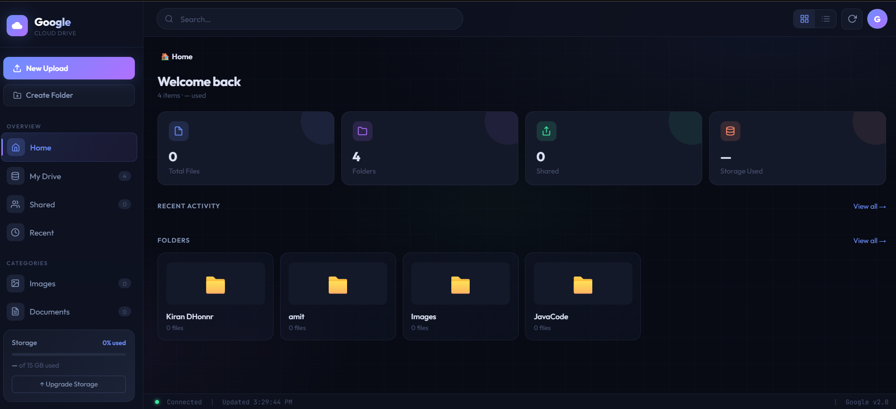

# Google Cloud Drive

> A Spring Boot microservices-based file management system that allows users to upload, download, organize files into folders, and search across the system.

---

## Screenshots



---

## Architecture Overview

The system is composed of three independent microservices:

```
┌─────────────────┐     ┌──────────────────┐     ┌──────────────────┐
│  File Service   │     │  Folder Service  │     │  Search Service  │
│  :8081          │     │  :8082           │     │  :8083           │
│                 │     │                  │     │                  │
│  /api/files     │     │  /api/folders    │     │  /api/search     │
└─────────────────┘     └──────────────────┘     └──────────────────┘
         │                       │                        │
         └───────────────────────┴────────────────────────┘
                         Feign Clients / REST
```

| Service | Package | Responsibility |
|---|---|---|
| **File Service** | `com.cfs.File_service` | Upload, download, and manage files |
| **Folder Service** | `com.CFS.Folder_Service` | Create and organize folder hierarchy |
| **Search Service** | `com.cfs.search_service` | Search files and folders by name |

---

## API Reference

### File Service — `/api/files`

| Method | Endpoint | Description |
|---|---|---|
| `GET` | `/api/files` | Get all files |
| `GET` | `/api/files/{id}` | Get file by ID |
| `GET` | `/api/files/folder/{folderId}` | Get all files in a folder |
| `PUT` | `/api/files` | Create a file record |
| `DELETE` | `/api/files/{id}` | Delete a file by ID |
| `POST` | `/api/files/upload` | Upload a file (multipart) |
| `GET` | `/api/files/download/{id}` | Download a file by ID |

#### Upload File — `POST /api/files/upload`

**Request** (multipart/form-data):

| Parameter | Type | Description |
|---|---|---|
| `name` | `String` | Display name for the file |
| `folderId` | `Long` | Target folder ID |
| `file` | `MultipartFile` | The file binary |

**Response:**
```json
{
  "success": true,
  "file": {
    "id": 1718000000000,
    "name": "report.pdf",
    "size": 204800,
    "folderId": 1,
    "path": "/files/1718000000000"
  }
}
```

#### Download File — `GET /api/files/download/{id}`

Returns the file as a binary stream with `Content-Disposition: attachment` header.

---

### Folder Service — `/api/folders`

| Method | Endpoint | Description |
|---|---|---|
| `GET` | `/api/folders` | Get all folders |
| `GET` | `/api/folders/{id}` | Get folder by ID |
| `GET` | `/api/folders/name/{name}` | Get folder by name |
| `GET` | `/api/folders/parent/{parentId}` | Get child folders by parent ID |
| `POST` | `/api/folders` | Create a folder (entity body) |
| `POST` | `/api/folders/create` | Create a folder (JSON body) |
| `DELETE` | `/api/folders` | Delete a folder by ID |

#### Create Folder — `POST /api/folders/create`

**Request Body:**
```json
{
  "name": "Documents",
  "parentId": null
}
```

**Response:**
```json
{
  "success": true,
  "folder": {
    "id": 1718000000001,
    "name": "Documents",
    "parentId": null
  }
}
```

> Folders support a **hierarchical structure** — set `parentId` to nest a folder inside another.

---

### Search Service — `/api/search`

| Method | Endpoint | Description |
|---|---|---|
| `GET` | `/api/search?query=` | Search both files and folders |
| `GET` | `/api/search/files?query=` | Search files only |
| `GET` | `/api/search/folder?query=` | Search folders only |

#### Search All — `GET /api/search?query=report`

**Response:**
```json
{
  "files": [
    { "id": 1718000000000, "name": "annual-report.pdf", ... }
  ],
  "folders": [
    { "id": 1718000000001, "name": "Reports", ... }
  ]
}
```

> Search is **case-insensitive** and uses substring matching.

---

## File Storage

Uploaded files are stored on disk under the `uploads/` directory relative to the File Service:

```
uploads/
└── {fileId}/
    └── {originalFileName}
```

The path is recorded in the database as `/files/{fileId}` for reference.

---

## Getting Started

### Prerequisites

- Java 17+
- Maven 3.8+
- A running relational database (configured per service)

### Running the Services

Each microservice is an independent Spring Boot application. Run each in a separate terminal:

```bash
# File Service
cd file-service
mvn spring-boot:run

# Folder Service
cd folder-service
mvn spring-boot:run

# Search Service
cd search-service
mvn spring-boot:run
```

### Configuration

Configure each service's `application.properties` or `application.yml`:

```properties
# File Service
server.port=8081
spring.datasource.url=jdbc:your-db-url
spring.datasource.username=your-username
spring.datasource.password=your-password

# Folder Service
server.port=8082

# Search Service
server.port=8083
file.service.url=http://localhost:8081
folder.service.url=http://localhost:8082
```

---

## Known Issues & TODOs

- `DELETE /api/folders` is missing the `@PathVariable` annotation — the `id` path variable is not bound correctly.
- `downloadFile` has a malformed header: `CONTENT_LENGTH` is concatenated with the value string instead of being set as a separate header value.
- File and Folder IDs are generated using `System.currentTimeMillis()` — consider using a UUID or database-generated sequence for production use.
- Search service fetches **all** records from File and Folder services and filters in memory — may not scale well with large datasets.
- No authentication or authorization is implemented.

---

## Project Structure

```
cfs/
├── file-service/
│   └── src/main/java/com/cfs/File_service/
│       ├── controller/FileController.java
│       ├── model/FileEntity.java
│       └── repo/FileRepository.java
├── folder-service/
│   └── src/main/java/com/CFS/Folder_Service/
│       ├── controller/FolderController.java
│       ├── model/FolderEntity.java
│       └── repo/FolderRepository.java
└── search-service/
    └── src/main/java/com/cfs/search_service/
        ├── controller/SearchController.java
        ├── client/FileSearchClient.java
        └── client/FolderSearchClient.java
```
